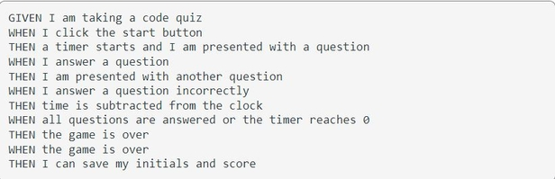

# JavaScript-Timed-Quiz

## Acceptance Criteria 

## Steps To Complete
- Build an HTML skeleton for the timed quiz.
- Create questions and answers.
- Use CSS to style HTML. 
- Use JavaScript to put a countdown on the page, and time the quiz. A wrong answer removes time off the timer.
- Use JavaScript to build dynamic elements on the page, one by one. 
- Use JavaScript to retrieve user input (answers) and store them in variables. 
- Make sure that the data is being set, stringified, then retreived and parsed back for JavaScript.
- Show the user their score and where it ranks. 